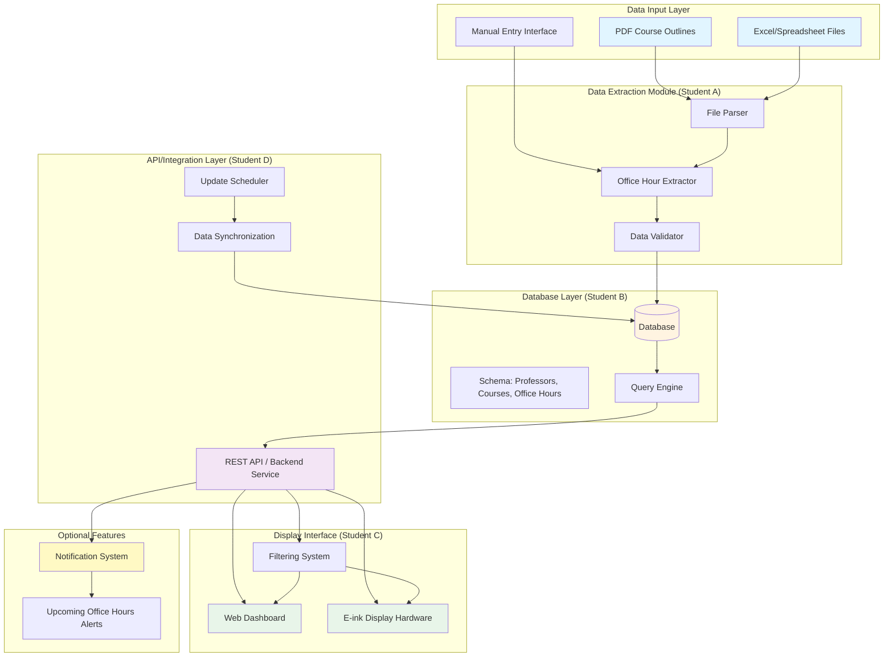

# Profinder Automated Office Hour Board - System Architecture

## System Architecture Diagram

## Component Breakdown

### 1. Data Input Layer
- **PDF Course Outlines**: Source documents containing office hour information
- **Excel/Spreadsheet Files**: Structured data files with schedules
- **Manual Entry Interface**: Admin interface for manual data entry/updates

### 2. Data Extraction Module (Student A)
- **File Parser**: Handles different file formats (PDF, XLSX, CSV)
- **Office Hour Extractor**: Extracts relevant information (professor name, time, location, course)
- **Data Validator**: Ensures extracted data is complete and valid

### 3. Database Layer (Student B)
- **Database**: Stores all office hour information
- **Schema**: 
  - Professors table
  - Courses table
  - Office Hours table (with relationships)
- **Query Engine**: Handles search and filtering operations

### 4. API/Integration Layer (Student D)
- **REST API**: Backend service connecting all components
- **Update Scheduler**: Weekly automated updates
- **Data Synchronization**: Keeps data consistent across updates

### 5. Display Interface (Student C)
- **Web Dashboard**: Browser-based interface for viewing office hours
- **E-ink Display Hardware**: Physical display board (optional)
- **Filtering System**: Filter by professor, course, time, etc.

### 6. Optional Features
- **Notification System**: Alerts for upcoming office hours
- **Upcoming Office Hours Alerts**: Push notifications or email alerts

## Data Flow

1. **Input**: Course outlines (PDF/Excel) are provided
2. **Extraction**: Parser extracts office hour data
3. **Validation**: Data is validated for completeness
4. **Storage**: Validated data is stored in database
5. **Processing**: API queries database based on user requests
6. **Display**: Results shown on web dashboard or e-ink display
7. **Updates**: Weekly scheduler updates database with new information

## Technology Stack Suggestions

- **Data Extraction**: Python (PyPDF2, pandas, openpyxl)
- **Database**: SQLite (development) / PostgreSQL (production)
- **Backend API**: Python Flask/FastAPI or Node.js Express
- **Web Dashboard**: React/Vue.js or vanilla HTML/CSS/JS
- **E-ink Hardware**: Raspberry Pi + e-ink display module
- **Scheduling**: Cron jobs or task scheduler

