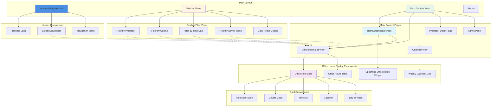
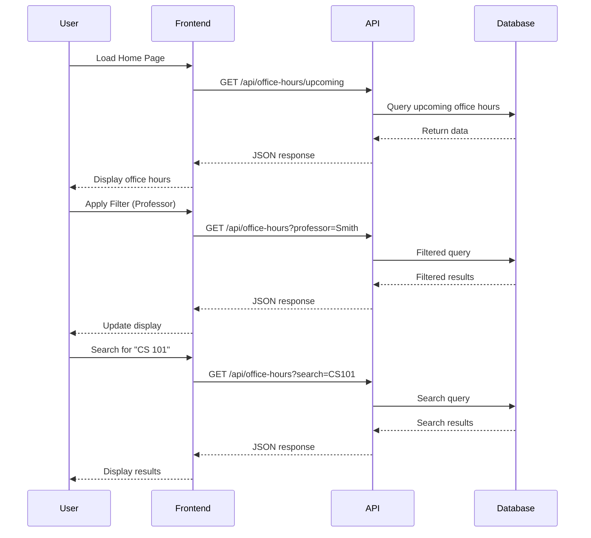

# Profinder Web Dashboard - Website Skeleton Diagram

## Page Layout Structure

```
┌─────────────────────────────────────────────────────────┐
│                    HEADER                                │
│  [Logo]  [Search Bar]              [Nav Menu]           │
├──────────┬──────────────────────────────────────────────┤
│          │                                               │
│ SIDEBAR  │            MAIN CONTENT AREA                  │
│          │                                               │
│ Filters: │  ┌─────────────────────────────────────┐     │
│          │  │                                     │     │
│ • Prof   │  │   Office Hours Display              │     │
│ • Course │  │   (Cards/Table/Calendar)            │     │
│ • Time   │  │                                     │     │
│ • Day    │  │                                     │     │
│          │  │                                     │     │
│ [Clear]  │  └─────────────────────────────────────┘     │
│          │                                               │
├──────────┴──────────────────────────────────────────────┤
│                    FOOTER                                │
└─────────────────────────────────────────────────────────┘
```

## Website Structure & Layout



## Website Pages & Routes

### 1. Home/Dashboard Page (`/`)
- **Components:**
  - Welcome message
  - Upcoming office hours widget (next 24-48 hours)
  - Quick stats (total professors, active office hours today)
  - Quick search bar
  - Recent updates notification

### 2. Office Hours List View (`/office-hours`)
- **Components:**
  - Filterable list of all office hours
  - Sortable table or card grid
  - Pagination
  - Active filters display

### 3. Calendar View (`/calendar`)
- **Components:**
  - Weekly calendar grid
  - Time slots displayed
  - Color-coded by professor or course
  - Click to view details

### 4. Professor Detail Page (`/professor/:id`)
- **Components:**
  - Professor information
  - All office hours for this professor
  - Associated courses
  - Contact information (if available)

### 5. Admin Panel (`/admin`)
- **Components:**
  - File upload interface
  - Manual data entry form
  - Database management
  - Update scheduler controls

## Component Breakdown

### Header Component
```
┌──────────────────────────────────────────────────┐
│ [Profinder Logo]  [Search...]  [Home] [Calendar] │
└──────────────────────────────────────────────────┘
```

### Office Hour Card Component
```
┌─────────────────────────────────────┐
│ Prof. John Smith                    │
│ CS 101 - Introduction to Computing  │
│ 📅 Monday, Wednesday                │
│ ⏰ 2:00 PM - 4:00 PM                │
│ 📍 Room 123, Engineering Building   │
└─────────────────────────────────────┘
```

### Filter Sidebar Component
```
┌─────────────────────┐
│ FILTERS             │
├─────────────────────┤
│ Professor:          │
│ [Dropdown/Select]   │
│                     │
│ Course:             │
│ [Dropdown/Select]   │
│                     │
│ Day:                │
│ ☐ Monday            │
│ ☐ Tuesday           │
│ ☐ Wednesday         │
│ ...                 │
│                     │
│ Time Range:         │
│ [From] [To]         │
│                     │
│ [Clear All Filters] │
└─────────────────────┘
```

## Data Flow in Website



## Responsive Design Structure

### Desktop View (> 1024px)
- Sidebar filters visible
- Multi-column card layout
- Full calendar view

### Tablet View (768px - 1024px)
- Collapsible sidebar
- 2-column card layout
- Scrollable calendar

### Mobile View (< 768px)
- Hamburger menu for filters
- Single column layout
- Stacked cards
- Simplified calendar view

## Technology Stack for Website

- **Frontend Framework**: React, Vue.js, or vanilla HTML/CSS/JS
- **Styling**: CSS3, Tailwind CSS, or Bootstrap
- **State Management**: React Context/Redux or Vuex
- **HTTP Client**: Axios or Fetch API
- **Routing**: React Router or Vue Router
- **Date Handling**: Moment.js or date-fns
- **Charts/Calendar**: FullCalendar, React Big Calendar, or custom

